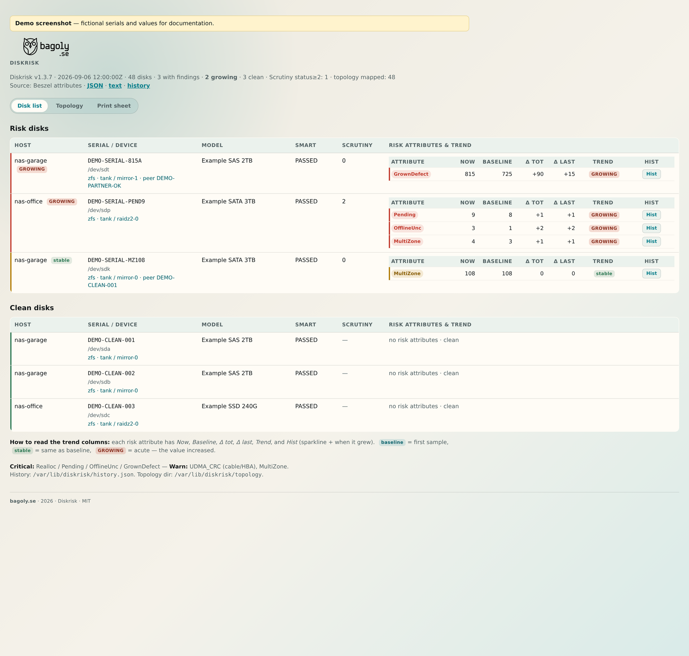
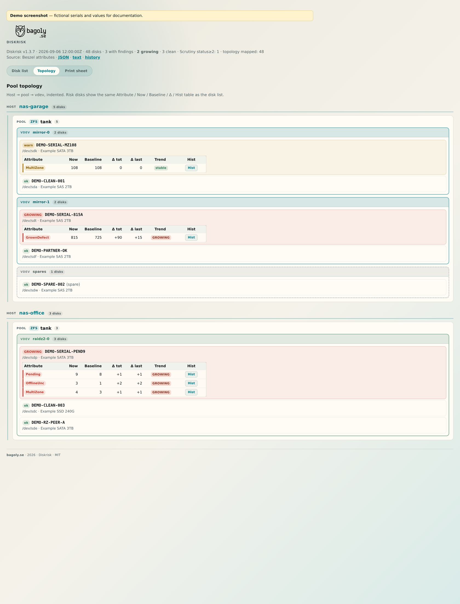
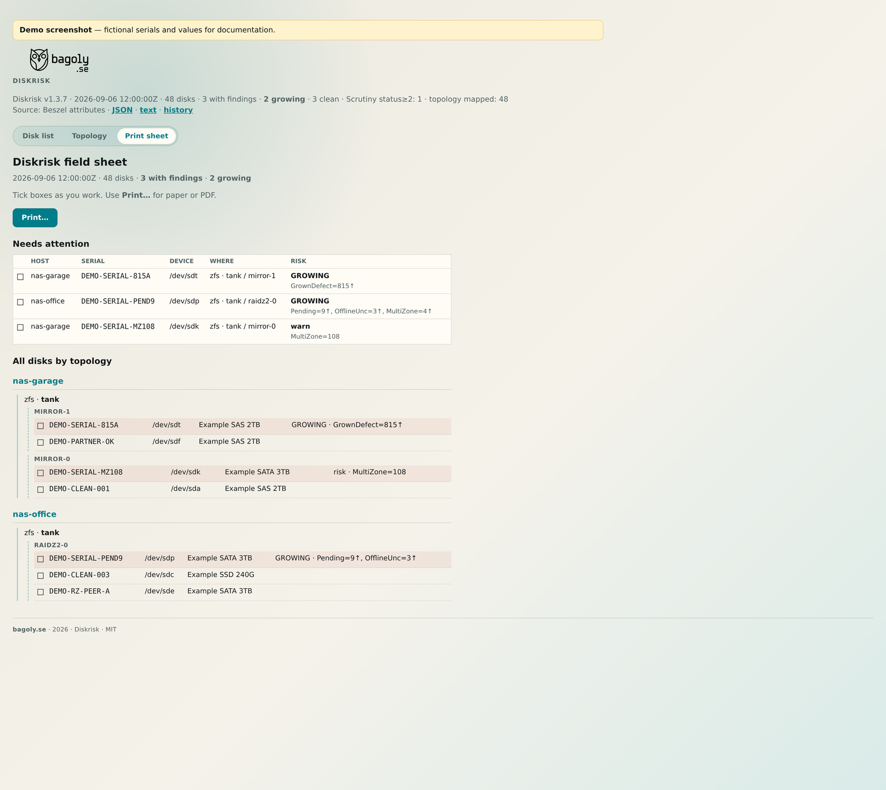
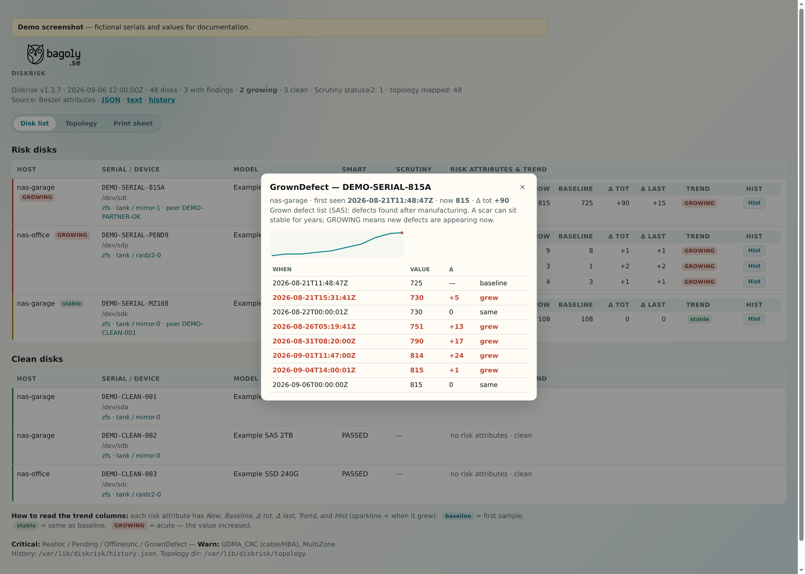
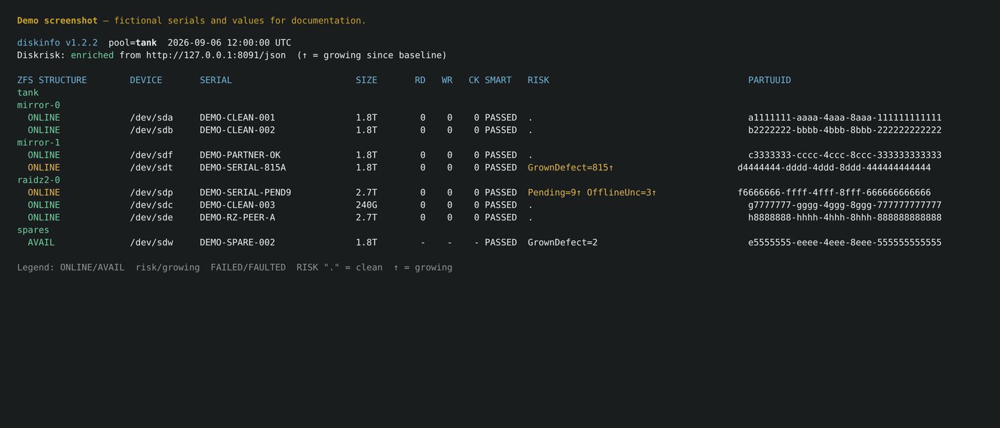

# Diskrisk

**v1.3.7** — find the **right physical disk** when something is dying, and see
**whether the problem is getting worse**, without chassis LEDs or vendor GUIs.

Built for DIY / homelab storage: shelves of identical drives, SAS JBODs, TrueNAS
boxes, and mixed pools where `/dev/sdX` names reshuffle after every reboot.

Issues and PRs welcome — see [CONTRIBUTING.md](CONTRIBUTING.md).

**AI-assisted project.** Substantial parts of the code and docs were written
with [Cursor](https://cursor.com/), **OpenAI Codex**, **Anthropic Claude**, and
other LLM tools under human direction. Details: [AI.md](AI.md).

## Why this exists

When a disk starts to fail you usually need three answers at once:

1. **Which drive is it?** — not `sdf`, but a stable **serial** you can read on
   the label when you are standing in front of the rack.
2. **Who shares its vdev?** — mirror partner, or the other disks in the same
   `raidz2-N` / `draid-N`. Several bad disks in **one** vdev is much worse than
   the same count spread across vdevs.
3. **Is it getting worse?** — SMART often still says **PASSED** while pending
   sectors or a grown-defect list are already climbing.

Many DIY builds have **no per-bay status lights**, no backplane blink, and no
nice “locate disk” button. You pull the wrong tray and you are gambling with
redundancy. Diskrisk + `diskinfo` close that gap:

| Tool | Job | Needs Diskrisk? |
|------|-----|-----------------|
| **diskinfo** (CLI on the NAS) | Print the pool as a **vdev tree** (mirror / raidz / draid): device → **serial** | **No** — works alone |
| **Diskrisk** (web / `/json`) | Rank disks by actionable SMART risk and **trend**; **Disk list** / **Topology** / **Print sheet** | — |
| **diskinfo --risk** | Same tree **+** SMART/RISK columns from Diskrisk | Optional enrichment |

Typical workflow: open Diskrisk (or `diskinfo --risk`), note the serial with
`GrownDefect=815↑` / `Pending=…`, walk to the chassis, match the sticker, replace
that drive — and check that its mirror partner is still clean (`.`).

Even without Diskrisk, `diskinfo` alone answers “which serial is in `mirror-1`
/ `raidz2-0`?”.

**Before a disk ever joins the pool**, burn it in (SMART short → long →
badblocks → long again) so you have a **pre/post SMART** baseline. See
[docs/disk-burn-in.md](docs/disk-burn-in.md). Diskrisk then watches whether
those counters **keep growing in production**.

```
Beszel ──┐
         ├──► smart_risk.py (:8091) ──► web /json /text
Scrutiny ┘              │
                        └──► diskinfo (ZFS vdevs + RISK)
```


## Screenshots (demo data)

Fictional serials — for illustration only.



*Disk list: multi-host risk with Now / Baseline / GROWING, Hist, pool/vdev under serial (v1.3.7).*



*Topology: Host → pool → **boxed** vdevs (mirror / raidz / …); risk disks include the full SMART trend table + Hist.*



*Print sheet: checkbox field list for the rack (attention first, then full topology).*



*History: first seen, sparkline, and each sample with Δ (grew / baseline / same).*



*`diskinfo`: ZFS vdev tree (mirror / raidz) — serial + SMART + RISK on one row.*

HTML sources used to regenerate the PNGs: [`docs/examples/`](docs/examples/).

**License:** MIT — see [LICENSE](LICENSE) and [THIRD_PARTY.md](THIRD_PARTY.md).

## Packaging

Small ops tool — **stdlib Python + bash**, no `pip`. Supported path:

**git clone → `/opt/diskrisk` → `./install.sh` / `./update.sh`**, with secrets in
`/etc/diskrisk/config.env`. Deb/rpm/Docker can wrap the same layout via
`DESTDIR=… ./install.sh --copy`.

Defaults are generic (`127.0.0.1`, pool **`tank`**, empty Scrutiny). Site URLs
and secrets belong only in `config.env` (gitignored / under `/etc`).

### Prerequisites

1. **Beszel hub** reachable (Diskrisk reads its SMART API).  
2. **Optional:** Scrutiny (`SCRUTINY_URL`).  
3. **diskinfo:** a host with ZFS (`zpool status`) — install the CLI there too
   (or the whole checkout) and set `SMART_RISK_URL` to your Diskrisk `/json`.

## Install / update (recommended)

Clone once into `/opt/diskrisk`. **Config stays in `/etc/diskrisk/config.env`** and
is never overwritten by install or update. One Diskrisk instance can watch
**many servers** (see [Multi-server](#multi-server) below).

### First install

```bash
sudo git clone https://github.com/nonifo/diskrisk.git /opt/diskrisk
cd /opt/diskrisk
sudo ./install.sh                 # in-place: links + systemd; keeps existing config
sudoedit /etc/diskrisk/config.env # BESZEL_USER / BESZEL_PASS / URLs
sudo systemctl start diskrisk
```

| Path | Purpose |
|------|---------|
| `/opt/diskrisk/` | Git checkout (app code) |
| `/etc/diskrisk/config.env` | Your secrets & site settings (`0600`) |
| `/var/lib/diskrisk/` | `history.json` trend store |
| `/usr/local/bin/diskrisk` | → `smart_risk.py` |
| `/usr/local/bin/diskinfo` | → `diskinfo/diskinfo.sh` |
| `diskrisk.service` | systemd unit |

```bash
systemctl status diskrisk
curl -sS http://127.0.0.1:8091/json | head
diskinfo                  # on each ZFS host; default pool: tank
```

### Update (config preserved)

```bash
cd /opt/diskrisk
sudo ./update.sh          # git pull --ff-only + refresh unit/symlinks + restart
```

`update.sh` never touches `/etc/diskrisk/config.env` or `history.json`.

### diskinfo only (no Diskrisk service)

On a ZFS NAS you can install **just** the CLI — no Beszel, no Python service:

```bash
sudo git clone https://github.com/nonifo/diskrisk.git /opt/diskrisk
cd /opt/diskrisk
sudo ./install.sh --diskinfo-only
diskinfo                  # ZFS vdev tree (default pool: tank)
diskinfo --risk           # optional: enrich if Diskrisk is reachable
```

Or without install: `./diskinfo/diskinfo.sh` from a checkout.

If you prefer a disposable checkout and a separate install tree:

```bash
git clone https://github.com/nonifo/diskrisk.git /tmp/diskrisk-src
cd /tmp/diskrisk-src
sudo ./install.sh --copy --prefix /opt/diskrisk
# later: pull in the src tree, then re-run the same install.sh --copy …
```

Still: config only in `/etc/diskrisk/config.env`.

### No root / laptop try-out

```bash
git clone https://github.com/nonifo/diskrisk.git diskrisk
cd diskrisk
cp config.example.env config.env
$EDITOR config.env
mkdir -p "$HOME/.local/share/diskrisk"
# SMART_RISK_HISTORY=$HOME/.local/share/diskrisk/history.json
# SMART_RISK_LISTEN=127.0.0.1:8091
python3 smart_risk.py
python3 smart_risk.py text    # one-shot
```

### Packaging flags

```bash
sudo ./install.sh --no-systemd
DESTDIR=/tmp/stage sudo ./install.sh --copy
```

## Multi-server

Diskrisk is meant for **one hub, many machines**:

1. Run **Beszel agents** on every NAS / host that has disks.
2. Point them at a single **Beszel hub**.
3. Run **one Diskrisk** against that hub (`BESZEL_URL`).

The UI **Host** column is the Beszel system name (`storage-01`, `nas-garage`,
…). Risk and GROWING trends are global across all agents. Run **`diskinfo` on
each ZFS host** (it needs local `zpool`) and point `SMART_RISK_URL` at the same
Diskrisk `/json` so RISK columns match the web UI.

Optional: set `SCRUTINY_URL` if you also run Scrutiny; leave empty to skip.

## Config

Search order (`DISKRISK_CONFIG` overrides):

1. `$DISKRISK_CONFIG`
2. `./config.env`
3. `/opt/diskrisk/config.env` (or the directory you cloned into)
4. `/etc/diskrisk/config.env`

**Environment variables always win over the file.** See `config.example.env`.

| Variable | Role |
|----------|------|
| `BESZEL_URL` / `BESZEL_USER` / `BESZEL_PASS` | Beszel hub login |
| `SCRUTINY_URL` | Optional Scrutiny base URL (empty = skip) |
| `SMART_RISK_LISTEN` | Bind address (default `0.0.0.0:8091`) |
| `SMART_RISK_HISTORY` | Trend history JSON path |
| `SMART_RISK_BRANDING` | Logo/favicon directory |
| `DISKRISK_PRODUCT` | UI product label |
| `DISKRISK_BRAND_URL` | Optional logo link |
| `DISKRISK_LOGO` | Logo filename in branding dir |
| `SMART_RISK_URL` | JSON URL for **diskinfo** enrichment |
| `DISKINFO_POOL` | Default ZFS pool for `diskinfo` (**`tank`**, the usual FreeBSD/TrueNAS example name) |

### Uninstall (system install)

```bash
sudo systemctl disable --now diskrisk 2>/dev/null || true
sudo rm -f /etc/systemd/system/diskrisk.service
sudo systemctl daemon-reload
sudo rm -f /usr/local/bin/diskrisk /usr/local/bin/diskinfo
sudo rm -rf /opt/diskrisk
# optionally: sudo rm -rf /etc/diskrisk /var/lib/diskrisk
```

## Components

| Path | What |
|------|------|
| `smart_risk.py` | Diskrisk HTTP service (HTML + `/json` + `/text`) |
| `topology_collect.py` | Per-host ZFS / mdadm / mergerfs topology → JSON for Diskrisk |
| `diskinfo/` | CLI: ZFS vdev tree (mirror/raidz/draid) + SMART/RISK columns |
| `branding/` | Optional UI assets |
| `config.example.env` | Template only — real config lives in `/etc/diskrisk/` |
| `install.sh` | First install / refresh (never overwrites config) |
| `update.sh` | `git pull` + refresh + restart |
| `scripts/release-assets.sh` | Source tarball + **SHA-256** `SHA256SUMS` for GitHub Releases |
| `docs/` | Operator manuals |

## Docs

- [AI.md](AI.md) — Cursor / Codex / Claude and other assistant tooling  
- [CHANGELOG.md](CHANGELOG.md) — release notes  
- [CONTRIBUTING.md](CONTRIBUTING.md) — how to suggest changes  
- [docs/SMART-risk-manual.md](docs/SMART-risk-manual.md) — architecture & attributes  
- [docs/diskinfo-manual.md](docs/diskinfo-manual.md) — columns & mirror partners  
- [docs/disk-burn-in.md](docs/disk-burn-in.md) — **pre-flight:** SMART short → long → badblocks → long (pre/post baseline)

## Requirements (summary)

- **Diskrisk:** Python 3.10+, network access to Beszel (and optionally Scrutiny)
- **diskinfo:** Linux + ZFS userland; same host or any host that can reach Diskrisk `/json`
